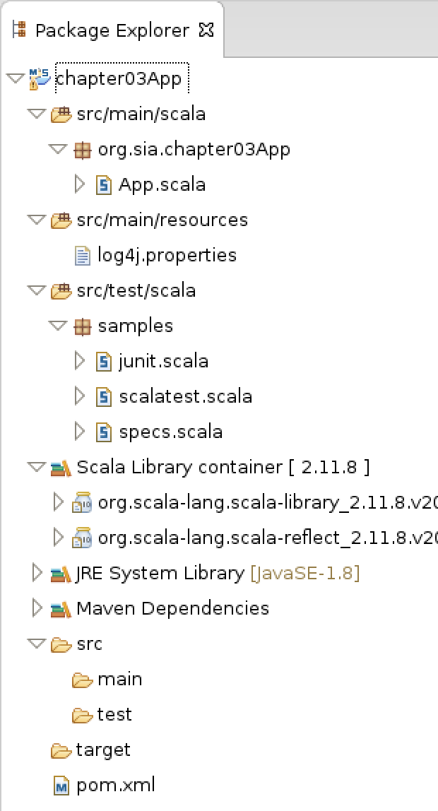

# 3장 스파크 애플리케이션 작성하기

IntelliJ나 Eclipse를 사용해서 스파크 애플리케이션을 작성해본다. 이 책에서는 Eclipse를 이용해 깃허브의 푸시 이벤트 발생 횟수를 집계하는 예제 애플리케이션을 만들 것!

## 3.1 이클립스로 스파크 프로젝트 생성

* 가상 머신 Eclipse 위치 _/home/spark/eclipse_
* 가상 머신 Workspace 위치 _/home/spark/workspace_

가상 머신에 설치된 이클립스 GUI를 사용하려면 먼저 X 윈도 시스템을 설정 후, 가상 머신 안에 있는 리눅스 셸의 DISPLAY 환경 변수에 X 윈도 시스템의 IP주소를 설정

이클립스로 실습을 진행하려면 아래 이클립스 플러그인 두 개가 필요

* 스칼라 IDE 플러그인
* 이클립스용 스칼라-메이븐 플러그인 \(m2eclipse-scala\)

Mac OS 에서 가상 머신에 접속하는 경우 1. [Xquartz](https://www.xquartz.org/) 다운로드 2. 가상머신에 `ssh -X spark@127.0.0.1 -P 2200`으로 접속 3. 터미널에서 Eclipse 실행

Eclipse에서 메이븐 프로젝트 생성

> File &gt; New &gt; Project &gt; Maven &gt; Maven Project

_Configure_에서 _Add Remote Catalog_를 클릭해 다음 내용 입력  
\(깃허브 저장소에 있는 스파크 버전과 모든 의존 라이브러리가 미리 설정된 빈 스파크 프로젝트를 생성하는 메이븐 아키타입 다운로드\)

```text
Catalog File:
https://github.com/spark-in-action/scala-archetype-sparkinaction/raw/master/archetype-catalog.xml

Description:
Spark in Action
```

프로젝트의 매개변수 입력

* _artifactId_: 프로젝트 이름. ex\) spark, play
* _groupId_: 프로젝트를 진행한 조직의 고유 명칭. ex\) org.apache, com.typesafe

_groupId_에 `org.sia` 입력, _artifactId_에 `chapter03App` 입력

 그러면 위 그림과 같이 `chapter03App`이라는 이름의 프로젝트 루트 폴더가 생성 되고, `org.sia.chapter03App` 이라는 루트 패키지 아래 `App.scala` 애플리케이션 소스 파일이 `src/main/scala` 스칼라 메인 소스 폴더 밑에 자동으로 생성된다.

이 프로젝트는 최상위 의존 라이브러리\(_pom.xml_에 명시적으로 나열된 의존 라이브러리\)를 일곱 개 사용한다.

## 3.2 스파크 애플리케이션 개발

모든 직원 명단과 각 직원이 수행한 푸시 횟수를 담은 리포트 개발\(...\)  
데이터는 [깃허브 아카이브](https://www.githubarchive.org)에서 하루치 데이터를 받아 사용하기로 한다.

### 3.2.1 깃허브 아카이브 데이터셋 준비

가상 머신에서 아래와 같은 명령 입력

```bash
mkdir -p $HOME/sia/github-archive
cd $HOME/sia/github-archive
wget http://data.githubarchive.org/2015-03-01-{0..23}.json.gz
```

위 명령을 실행하면 2015년 3월 1일 깃허브 활동 로그를 시간대별로 다운받을 수 있다. 대신 전체 용량이 크므로, 애플리케이션을 개발할 때는 첫 번째 파일만 사용한다.

```bash
gunzip 2015-03-01-0.json.gz
```

각 로그 파일에는 _유효한 json 문자열 여러 개가 한 줄에 하나씩 기록_되어 있다. 즉 각 줄에는 깃허브 이벤트\(push, branch, create repo 등\) 하나를 json 형태로 저장되어 있다.

[jq](http://stedolan.github.io/jq/download)를 이용해 json을 보면 쉽게 구조를 파악할 수 있다.

```bash
head -n 1 2015-03-01-0.json | jq '.'
```

### 3.2.2 JSON 로드

Spark SQL과 `Dataframe`은 JSON 데이터를 스파크로 로드하는 기능을 제공한다. 스파크 버전 1.6.0은 `DataFrame`을 개선하고 일반화한 `Dataset`을 도입했다.

`DataFrame`은 스키마가 있는 `RDD`다. 각 column 별로 이름과 타입을 가진다. 스파크는 정형 데이터셋을 `DataFrame`으로 생성할 때 알아서 데이터 스키마를 유추하며, 이 _데이터 스키마를 참고해 실행 계획을 만들어 더 나은 계산 최적화_를 이끌어낼 수 있다.

`DataFrame` API를 이용해 사용자는 스파크 코어 API를 사용하는 것보다 손쉽게 SQL로 원하는 작업을 수행할 수 있다.

스파크 코어는 다른 모든 스파크 컴포넌트를 건설할 수 있는 _기초적인 레고 조각의 집합_으로 생각할 수 있다. `DataFrame`으로 작성한 코드 역시 _스파크 코어 변환 연산자로 자동 변환_된다.

스파크 SQL의 메인 인터페이스인 `SQLContext` 클래스는 스파크 2.0 버전에서 `SparkContext`와 함께 `SparkSession`클래스로 통합되었다. `SQLContext`의 `read` 메서드는 다양한 데이터를 입수하는 데 사용할 수 있는 `DataFrameReader` 객체를 반환한다. 여기서는 json데이터를 읽기 위해 `DataFrameReader`의 `json` 메서드를 사용한다.

_**json 메서드 시그니처**_

```scala
def json(paths: String*): DataFrame
// Loads a JSON file (one object per line) and returns the result as a [[DataFrame]].
```

이클립스에서 _App.scala_ 파일을 열어 `SparkSession`을 초기화하는 부분을 제외한 부분을 모두 지우고, json파일을 로드하는 아래 코드를 추가한다. 그러면 spark는 json을 읽어 `DataFrame`을 반환한다. 스파크 2.0부터는 `DataFrame`이 `Dataset`의 일종, 즉 `Row` 객체를 요소로 포함하는 `Dataset`으로 변환되어서, `ghLog`의 class를 찍어보면 `Dataset`으로 출력된다.

```scala
val homeDir = System.getenv("HOME")
val inputPath = homeDir + "/dia/github-archive/2015-03-01-0.json"
val ghLog = spark.read.json(inputPath)
```

`Dataset`이 가진 여러 버전의 `filter`함수가 있는데, 그 중 하나는 `String` 타입의 조건식을 받을 수 있고, 다른 하나는 `Column`객체를 받을 수 있다. 여기서 `String`을 인수로 받는 함수는 조건식을 SQL 형식으로 파싱할 수 있다.

아래 코드를 추가해 `PushEvent` 로그만 가져올 수 있다.

```scala
val pushes = ghLog.filter("type = 'PushEvent'")
```

### 3.2.3 이클립스에서 애플리케이션 실행

아래와 같은 코드를 추가해 애플리케이션 결과가 어떻게 나오는지 확인해보자

```scala
pushes.printSchema // pushes DataFrame의 스키마를 보기 좋게 출력
println("all events: " + ghLog.count)
println("only pushes: " + pushes.count)
pushes.show(5) // DataFrame의 상위 다섯 개 Row를 테이블 형태로 출력 (인수를 전달하지 않으면 20개 출력)
```

JSON 스키마는 _JSON 파일에 사용된 모든 key의 합집합으로 구성_되며, 각 키에는 _값 타입_과 _널값 허용 여부\(nullable\)_ 가 할당되어 있다. 유추된 스키마에는 nullable이 항상 `true`이다.

### 3.2.4 데이터 집계

이제 푸시 이벤트를 _사용자 이름으로 그루핑해서 각 그룹별 로우 개수\(즉, 각 사용자별 푸시 횟수\)_ 를 알아보자

```scala
val grouped = pushes.groupBy("actor.login").count
grouped.show(5)
```

`groupBy("actor.login")` 코드는 SQL의 `GROUP BY`와 마찬가지로 `pushes`의 모든 로우를 `actor.login` 컬럼별로 그루핑한다. 위 코드의 결과는 아래와 같다.

```bash
+------------+-----+
|       login|count|
+------------+-----+
|john-griffin|    1|
|   digitized|    3|
| theCodeBear|    1|
|      WillHK|    1|
|  sakuya3834|    1|
+------------+-----+
only showing top 5 rows
```

하지만 위 결과는 `count` 수 별로 정렬되어 있지 않아 가장 많이 푸시한 사람을 알 수는 없다. 아래의 `grouped("count")`는 `count` 컬럼 객체를 반환하며 이 컬럼 객체의 `desc` 메서드를 호출해 `grouped` DataFrame을 내림차순으로 정렬한다. \(기본 정렬 순서는 `asc`\)

```scala
val ordered = grouped.orderBy(grouped("count").desc)
ordered.show(5)
```

출력 결과

```bash
+------------------+-----+
|             login|count|
+------------------+-----+
|      greatfirebot|  192|
|diversify-exp-user|  146|
|     KenanSulayman|   72|
|        manuelrp07|   45|
|    mirror-updates|   42|
+------------------+-----+
```

### 3.2.5 분석 대상 제외

전 결과는 모든 깃허브 푸시 이벤트를 사용해 얻어낸 결과이므로, 분석할 회사 직원이 아닌 사람은 분석 결과에서 제외해야 한다.

회사 직원 목록은 `first-edition/ch03/ghEmployees.txt`파일에 있다.

이 파일을 먼저 로드하자.

```scala
import scala.io.Source.fromFile

val empPath = homeDir + "/first-edition/ch03/ghEmployees.txt"
val employees = Set() ++ ( // Set() 메서드는 요소가 없는 불변 Set 객체 생성, ++ 메서드는 이 Set에 복수 요소 추가
    for { // 파일의 각 줄을 읽어 들여서 line변수에 저장
        line <- fromFile(empPath).getLines
    } yield line.trim // for 루프 각 사이클 별로 line.trim 하나를 임시 컬렉션에 추가. 임시 컬렉션은 for 루프가 종료될 때 전체 for 표현식의 결과로 반환된 후 삭제됨
)
```

#### 직원 Set 생성 과정

for 루프 한 사이클의 과정 1. 파일에서 한 라인 읽기 2. 새로운 `line` 변수를 초기화하고 변수 값에 파일의 현재 라인을 저장 3. `line` 변수 값을 가져와 양 끝의 공백 문자를 제거\(trim\)한 후 임시 컬렉션에 추가

for 루프가 종료된 후 진행 과정 1. 임시 컬렉션을 for 표현식의 결과로 반환 2. `Set`에 for 표현식의 결과로 반환된 임시 컬렉션 추가 3. `Set`을 `employees`에 할당

위 표현식을 스칼라에서 _for comprehension_이라고 한다. 반복 인덱스 변수를 사용할 필요가 없다.

이제 직원들의 이름을 담은 `Set`을 이용해 `ordered`에 `filter`를 적용해보자.

_**filter 메서드 시그니처**_

```scala
def filter(conditionExpr: String): Dataset
```

이 `filter`메서드는 주어진 _SQL 표현식_을 사용해 결과값을 얻어낸다.

```scala
val oldPeopleDf = peopleDf.filter("age > 15")
```

하지만 위와 같은 단순 비교와 다르게 우리는 `ordered`의 `login` 컬럼과 방금 얻어낸 직원 ID를 보유한 `Set`을 비교해 `Set`에 포함되지 않은 로우들만 제외해야 한다. `Dataset`의 `filter`함수를 사용하면 손쉽게 할 수 있지만, `DataFrame`의 SQL 표현식에서는 이 함수를 사용할 수 없다. 대신 스파크의 _User-Defined Function_을 사용할 수 있다.

_사용자 정의 함수는 `SparkSession` 클래스의 UDF메서드로 등록_한다. 우리는 아래처럼 함수를 만들 수 있다.

```scala
val isEmp: (String => Boolean) = (user: String) => employees.contains(user)
// 스칼라의 타입 추론을 활용해 아래처럼 정의 가능
val isEmp = user => employees.contains(user)
```

* 스칼라는 `employees`가 `String`의  `Set`이라는 사실로 `user`가 `String`타입이어야 한다고 알 수 있음
* 함수의 반환 값이 `contains`의 반환 값이라는 사실을 통해 결국 함수의 반환값이 `Boolean`이라는 것도 알 수 있음

아래와 같은 코드로 `isEmp` 함수를 UDF로 등록할 수 있다.

```scala
val isEmployees = spark.udf.register("isEmpUDF", isEmp)
```

이렇게 등록된 UDF는 스파크 클러스터에서 실행될 수 있다. 스파크는 UDF에 필요한 객체\(`employees`\)를 모두 가져와 _클러스터에서 실행하는 모든 태스크에 전송_한다.

### 3.2.6 공유 변수

공유 변수를 설정하지 않고 예제 프로그램을 실행하면 스파크는 `employees` 를 대략 200회\(즉, 필터링 작업을 수행할 태스크 개수\) 가까이 반복적으로 네트워크에 전송하게 될 것이다.

공유 변수는 클러스터의 각 노드에 **정확히 한 번**만 전송하며, 공유 변수는 클러스터 노드의 메모리에 자동으로 캐시되므로 실행 중에 바로 접근할 수 있다. 따라서 사용이 간편하다.

스파크는 P2P 프로토콜을 사용해 공유 변수를 전파한다. 워커 노드들이 서로 공유 변수를 교환하며 클러스터 전체에 공유 변수를 유기적으로 확산시킨다. 이런 노드 간 통신 기법을 [가십 프로토콜](https://goo.gl/uwQArj)이라고 한다.

`employees`를 공유 변수로 바꿔보자.

우선 아래 코드를 `isEmp`함수를 정의했던 코드 바로 앞에 추가한다.

```scala
val bcEmployees = sc.broadcast(employees)
```

공유 변수에 접근하려면 반드시 `value` 메서드를 사용해야 한다. 기존 `isEmp` 함수를 아래와 같이 바꾼다.

```scala
val isEmp = user => bcEmployees.value.contains(user)
```

이제 `isEmployee` UDF를 사용해 `ordered` `DataFrame`을 필터링 할 수 있다.

```scala
import spark.implicits._
val filtered = ordered.filter(isEmployee($"login"))
filtered.show()
```

위 코드는 `isEmployee` UDF에 `ordered` 의 `login` 컬럼을 적용한 결과를 기준으로 `filter` 메서드를 실행한다.

실제 애플리케이션을 작성할 때는 애플리케이션을 검증 및 운영 환경으로 넘기기 전에 `appName`, `appMaster`, `inputPath`, `empPath` 변수를 애플리케이션의 매개변수로 만들어야 한다. 최종적으로 어떤 클러스터에서 애플리케이션을 실행할지는 알 수 없다. 하지만 소스 코드에 매개 변수를 하드코딩하면 이 값을 변경할 때마다 다시 컴파일 해야 한다.

### 3.2.7 전체 데이터셋 사용

시간 별 Push Event를 통계내는 앱을 만들었으니 이제 전체 데이터셋을 사용해 통계를 내보자.

아래와 같이 json 파일을 읽어오는 코드를 변경하면 github-archive 폴더 아래 모든 json 파일을 한꺼번에 읽어올 수 있다.

```scala
val inputPath = homeDir + "sia/github-archive/*.json
```

## 3.3 애플리케이션 제출

어디서든 애플리케이션을 실행하고 사용하려면 애플리케이션 실행에 필요한 모든 의존 라이브러리에 애플리케이션이 접근할 수 있어야 한다. 스파크 클러스터에서는 모든 스파크 라이브러리와 스파크 의존 라이브러리에 접근할 수 있다. 이제 애플리케이션을 스파크 클러스터에서 실행해보자.

_pom.xml_ 파일을 열어 _Dependency Hierarchy_ 탭으로 전환하면 애플리케이션의 의존 라이브러리를 확인할 수 있다.

### 3.3.1 uberjar 빌드

운영 환경에서 스파크 프로그램을 원활하게 실행할 수 있도록 프로그램에 JAR 파일을 추가하는 방법은 아래 두 가지다. 1. _spark-submit_ 스크립트의 `--jars` 매개변수에 프로그램에 필요한 JAR파일을 모두 나열해 실행자로 전송. 여러 클러스터를 운영할 경우 라이브러리를 일일이 배치해야 함. 2. 모든 의존 라이브러리를 포함하는 uberjar를 빌드

이 책에서는 uberjar를 이용해 실습할텐데, 그 전에 외부 의존 라이브러리를 하나 더 추가하자. 이제 우리는 우리의 애플리케이션과 함께 이 외부 의존 라이브러리와 이 라이브러리가 사용하는 모든 의존 라이브러리를 포함한 JAR파일을 배포해야 한다.

_pom.xml_에 아래와 같은 내용 추가

```markup
<dependency>
    <groupId>org.apache.commons</groupId>
    <groupId>commons-email</groupId>
    <version>1.3.1</version>
    <scope>compile</scope>
</dependency>
```

### 3.3.2 애플리케이션의 적응력 올리기

운영 환경에서 _spark-submit 스크립트_로 애플리케이션을 실행하기 위해 아래 코드를 변경해 애플리케이션 이름과 스파크 마스터를 지정하는 부분을 _spark-submit 인수로 전달_하도록 변경해보자.

```scala
val spark = SparkSession.builder()
    .appName("The swankiest Spark app ever")
    .master("local[*]")
    .getOrCreate()

// 아래와 같이 빈 SparkConf를 사용해 생성하도록 변경

val spark = SparkSession.builder().getOrCreate()
```

이 외에 로그 파일 경로나 프로그램 결과를 출력할 파일 경로, 출력 파일의 형식 등을 애플리케이션 매개 변수로 변경해 _spark-submit_을 호출하는 사람이 결정하도록 코드를 변경한다.

모든 소스코드를 변경했으면, Goal을 `clean package`로 입력하여 Maven Build를 실행한다.

그러면 프로젝트의 _target_ 폴더에 _chapter03App-0.0.1-SNAPSHOT.jar_ 파일이 생성된 것을 확인할 수 있다.

### 3.3.3 spark-submit 사용

_spark-submit_은 스파크 애플리케이션을 제출하는 일종의 헬퍼 스크립트로 _애플리케이션을 스파크 클러스터에서 실행_하는 데 사용한다.

가상 머신에서 스파크 로그는 _/usr/local/spark/logs/info.log_에 떨어지므로 이 파일로 애플리케이션 실행 로그를 확인하면 된다.

터미널에서 jar가 있는 _target_디렉토리 위치에서 아래 명령을 실행

```bash
spark-submit --class org.sia.chapter03App.GitHubDay --master local[*] --name "Daily GitHub Push Counter" chapter03App-0.0.1-SNAPSHOT.jar "$HOME/sia/github-archive/*.json" "$HOME/first-edition/ch03/ghEmployees.txt" "$HOME/sia/emp-gh-push-output" "json"
```

만약 파이썬의 경우는 아래와 같은 스크립트를 실행하면 된다.

```bash
spark-submit --master local[*] --name "Daily GitHub Push Counter" GitHubDay.py "$HOME/sia/github-archive/*.json" "$HOME/first-edition/ch03/ghEmployees.txt" "$HOME/sia/emp-gh-push-output" "json"
```

애플리케이션이 정상적으로 실행되고 나면 _$HOME/sia/emp-gh-push-output_ 디렉토리에서 결과 json파일들을 확인할 수 있다. 결과 폴더에 있는 _\_SUCCESS_ 파일은 _작업을 성공적으로 완료했음을 의미_하며 _crc_ 파일은 각 데이터 파일의 유효성을 검사하는 데 사용한다. 마지막으로 _\_SUCCESS.crc_ 파일은 모든 CRC파일을 검사한 결과가 성공적이라는 걸 의미한다.

